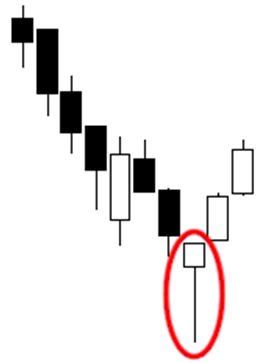

[Link to original videos](https://docs.google.com/document/d/15c3rN15rkXldY8Te3GDG4NG7noaaoikydOoZQlElwXw/edit?usp=sharing)

--- 

## #1: Candlestick Charts
### What is technical analysis: 
- way to make probabilistic forecasts of future price behaviour
  - you don't have to be a technical trader, you can use it to look for best risk/reward long entries if you're fundamentally bullish on an asset  
- can be thought of as a risk management tool

### Candlestick Anatomy: 
- red = closing price below opening price
- green = closing price above opening price
- OHLC = Open, High, Low, Close

Side note: lines drawn on a particular time frame are still displayed at different time frames. You can label them to give you context without having to jump back to the original time frame

### Time Frames: 
- dictates the time period that 1 candle represents
- for beginners, focus on higher time frames (eg. Cred's favourites are Daily and Hourly time frames) 

**Candle closes are very significant, especially at higher time frames -> don't get ahead of yourself before a candle close**

### Candlestick Patterns: 
- lots of candlestick patterns are reversal patterns. Beginner mistake is to try to trade every instance regardless of context. Don't look for candlestick patterns when price is ranging, but do when there is a strong upwards/downwards trend 
- [Babypips Cheat Sheet](https://www.babypips.com/learn/forex/japanese-candlesticks-cheat-sheet)
- Patterns mentioned in video: 
  - Doji (Neutral)

  - Shooting Star (Bearish)

  - Hammar (Bullish)

  - Bullish Engulfing (Bullish)

  - Bearish Engulfing (Bearish)

  - Tweezer Tops (Bearish)

  - Tweezer Bottoms (Bullish)

  